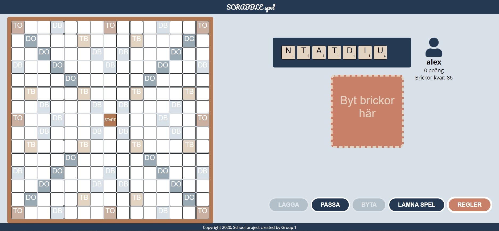
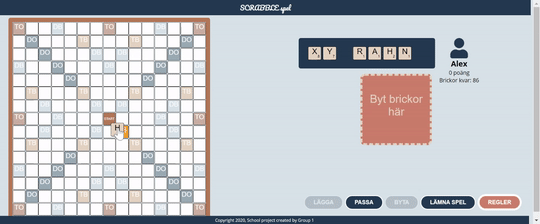
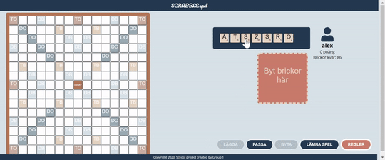
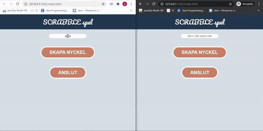

## Scrabble (Word Feud)

School project done in a team enviroment using **Scrum** methodology.

Scrabble game written in HTML + CSS + JS + jQuery.

### Features:
* Up to 4 players can play on the same PC
* Drag-n-drop objects
* Word checker with SAOL (Svenska Akademins Ordlista)
* Network version available in develop-network branch
* Fully mobile-friendly version

### General look of the game:

### Drag-n-drop and word-checker:

### Invalid move:

### Network:

